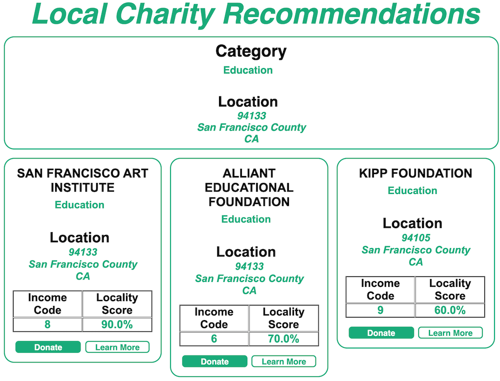
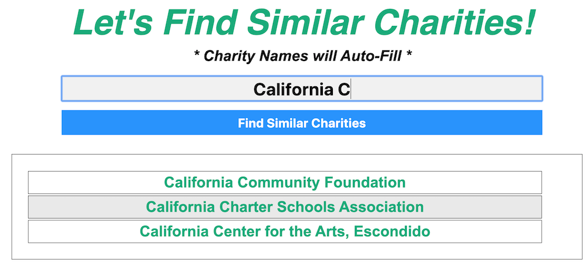
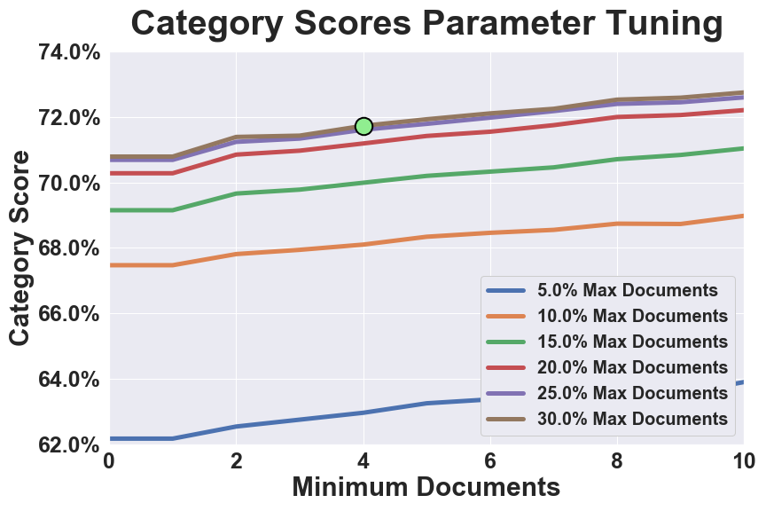
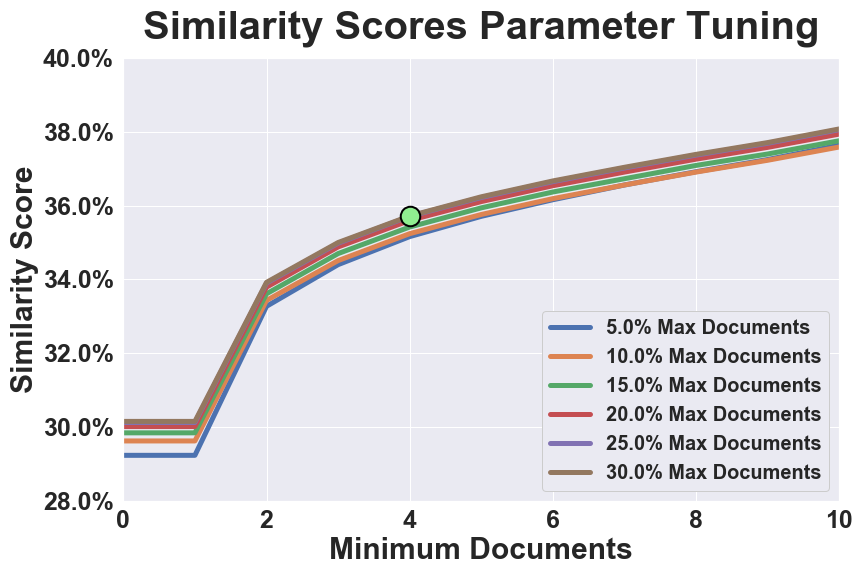

# Charity Recommender

Access the web application at [http://www.charityrecommender.com/](http://www.charityrecommender.com/)

A 1-page project summary is available [here](IMG/Charity_Recommender_1pager.pdf)

## Project Motivation
- This project was motivated by the desire to connect people with charitable organizations in their communities.
- Recommending charities for people to donate their time or resources to can transform communities and positively change lives.

## Goals:
- Recommend local charities from a user-selected category and zipcode
- Recommend similar charities to a user-selected charity
- Recommend charities that match a keyword search or description

# Table of Contents
- [Overview of the Data](#Overview-of-the-Data)
- [Exploratory Data Analysis](#Exploratory-Data-Analysis)
- [Local Recommender](#Local-Recommender)
- [Similar Recommender](#Similar-Recommender)
- [Wordclouds](#WordClouds)
- [Conclusion and Next Steps](#Conclusion-and-Next-Steps)

# Overview of the Data

## First Dataset - IRS:
#### The first dataset comes from [IRS.gov](https://www.irs.gov/charities-non-profits/exempt-organizations-business-master-file-extract-eo-bmf) and contains information about charitable organizations in the United States

- Original Data Set
  * 1,719,673 charities (rows) with 28 features for each charity (columns)
- Data Cleaning:
  * Keep charities that offer fully tax deductible donations and have an NTEE Category Code
  * Translate NTEE code into category column and keep essential column features
- Cleaned Data Set
  * 992,318 charities (rows) with 10 features for each charity (columns)

#### Preview of IRS Data Set:

| EIN | NAME | STATE |INCOME_CD | ZIP_FIVE	 | NTEE_Major_Category	 |  County |
|:---:|:---:|:---:|:---:|:---:|:---:|:---:|
|10130427	|BRIDGTON HOSPITAL	|ME	|9	|04009	|Health - General and Rehabilitative	|Cumberland County|
|10024645	|BANGOR SYMPHONY ORCHESTRA	|ME	|6	|04402	|Arts, Culture and Humanities	|Penobscot County|
|10015091	|HANOVER SOCCER CLUB INC	|NJ	|4	|07927	|Recreation, Sports, Leisure, Athletics	|Morris County|

## IRS Dataset - Exploratory Data Analysis

|||
|---|---|
|Charity Income Codes, along with a "locality factor," are used to generate recommendations. This chart shows that the of the charities in the dataset have a code of 3 or 4, with about 8% having a code of 7, 8, or 9|Investigating the charities counts by state reveals that California is the most common charity headquarter location, constituting about 11% of our dataset. The next three most-common are Texas, New York, and Florida at about 7% each.|

|||
|---|---|
|Charity Categories are another factor used for generating recommendations. The most common charity categories in the USA are Religious and Education charities, followed by Human Services, Philanthropy, and Arts, Culture, and Humanities.|This map takes a closer look at the charity distribution in California. Within California, the charitable organizations are centered around The SF Bay Area and Los Angeles. Charities also appear to be more frequent along the coast than inland.|

## Second Dataset - CharityNavigator:
#### The second dataset comes from [CharityNavigator.org](https://www.charitynavigator.org/) and contains detailed charity information including description, motto, and overall score. The data is availble [Here](https://www.kaggle.com/katyjqian/charity-navigator-scores-expenses-dataset).

- Original Data Set
  * 8,400 charities (rows) with 20 features for each charity (columns)
- Data Cleaning:
  * Create "corpus" column that contains information about charity category, description, motto, and state
- Cleaned Data Set
  * 8,400 charities (rows) with 8 features for each charity (columns)

#### Preview of CharityNavigator Data Set:

| name	|ein	|category	|description	|motto	|score	|state
|:---:|:---:|:---:|:---:|:---:|:---:|:---:|
|1000 Friends of Oregon	|930642086	|Environment	|Working with Oregonians to enhance our quality...|	Great communities. Working lands. Iconic Places.	|91.94	|OR|
|WYPR	|311770828	|Arts, Culture, Humanities	|Serving the metropolitan Baltimore area and th...|	88.1 FM -. Your NPR News Station	|85.59	|MD|
|Two Ten Footwear Foundation	|222579809	|Human Services	|Funded solely by the footwear industry, Two Te...|	Shoepeople Helping Shoepeople	|90.26|	MA|

<a href="#Charity-Recommender-System">Back to top</a>

## CharityNavigator Dataset - Exploratory Data Analysis

|||
|---|---|
|The distribution of charity description lengths is left-skewed with a median of 690 characters. These descriptions will serve as the documents to create the TF-IDF vectorizer which will be used to find similarity between charities.|The distribution of charity scores, as ranked by CharityNavigator, is left-skewed with a median of 88.31% These scores are indicators of a charity's financial health and Accountability & Transparency.|

|||
|---|---|
|The most common charity category in our database is Human Services, which constitutes 28.32% of charities. The second most common is Arts, Culture, and Humanities at 14.5% followed by Health and Community Development at about 10% each.|Investigating the charities counts by state reveals that New York and California are the most common charity headquarter locations, constituting about 12% of our database each. The next three most-common are Texas, Washington D.C., and Florida at about 5% each.|

<!-- # For further EDA please look at the summary [here](ExploratoryDataAnalysis.md) -->

<a href="#Charity-Recommender-System">Back to top</a>

# Local Recommender
<!-- #region -->
#### Steps for Building the Local Recommender:
- Receive a **category** and **zipcode** as user input
- Filter charities on selected category
- Assign a **"locality score"** to each charity
  * **Locality Score = (Income Code * Locality Factor) / 50
   * *Income code* represents annual income of charity, higher income generally means more established charities
   * *Locality Factor* represents how "local" the charity is to the user, determnined zipcode, county, or state match
   * 50 Represents the maximum score, and is used to convert from a score to a percentage
 - The **Top 3** highest-scoring charities are recommended to the user

## 

## 

#### The code to do this can be found [here](src/Local_Charity_Recommender_Notebook.ipynb)

# Similar Recommender
<!-- #region -->
#### Steps for Building the Similar Recommender:
- Receive a **charity name** as user input
- Access CharityNavigator database to refer to that charity's information (category, description, and motto)
- Compare that charity's information to the TF-IDF model of charities in our database to generate **"similarity scores"**
  * **TF-IDF** stands for **Term Frequency - Inverse Term Frequency**
  * *Term Frequency* refers to how frequently a word from on document occurs in another document
  * *Inverse Term Frequency* refers to how important a given word is in creating a match, determined by "rarity" of word usage
- The **Top 3** highest similarity-scoring charities are recommended to the user

## 

## 

#### The code for this can be found [here](src/Similar_Charity_Recommender_Notebook.ipynb)

<a href="#Charity-Recommender-System">Back to top</a>
<!-- #endregion -->

# Scoring the Similar Recommendation Model
The **two criteria** used to score the similar recommendation model are **Category Scores** and **Similarity Scores**.

#### Category Scores
The CharityNavigator Dataset contains 11 categories. Recommending one of these categories at random would result in the same category  getting recommended 1/11 or 9.09% of the time, which will be the baseline for the model. The goal for the recommendation model is to improve category score to above 50%.

#### Similarity Scores
The Similarity Scores are calculated using the cosine similarity of the TF-IDF vector representations between documents. The three highest similarly scored documents will be returned as the top 3 recommended charities. 

#### Hyperparameter Tuning
The two hyperparameters of interest in tuning the model are **minimum word** count and **maximum percent** exclusion of words. 

**Minimum word** counts refers to the minimum number of documents a word must appear in to be featured in the model.

**Maximum percent** exclusion refers to the maximum percentage of documents a word can appear in before it is excluded. For example, a maximum percent of 25% means that a word cannot appear in more than 25% of documents.

Increasing the minimum word count and the maximum percent exclusion will also decrease the number of tokens (words) used to analyze charities and make similarity recommendations. The hypertuning of this model will seek to balance the optimization of category and similarity scores with the loss of tokens from the corpus. 

|||
|---|---|
|The category scores increase as the maximum percentage excluded and minimum word count increases. However, the score increase starts to plateau at 24% maximum percentage exclusion while offering only marginal increases after 4 minimum words.|The similarity scores also generally increase as the maximum percentage exclusion increases and minimum word counts increases. There is a significant increase in similarity scores from 0 to 4 minimum words, with marginal increases after 4 minimum words.|

The optimal hyperparameters for this model are 4 minimum words and 24% maximum percentage exclusion, which results in a category score of 70.1% and a similarity of score of 34.8%

|||
|---|---|
|The distribution of token amounts for each charity is normally distibuted with a mean of 35 tokens. These tokens are the unique words that represent each charity and are used by the model to recomend similar charities.||

#### The code for this can be found [here](src/Similar_Charity_Recommender_Notebook.ipynb)

<a href="#Charity-Recommender-System">Back to top</a>

# Conclusion and Next Steps

# Deployment

Web Application Deployed on an Amazon Web Services via Elastic Beanstalk at [http://www.charityrecommender.com/](http://www.charityrecommender.com/)

## Built With

* [Python](https://www.python.org/) - Coding Language for Machine Learning Application
* [Gensim](https://radimrehurek.com/gensim/index.html) - Used for Latent Dirichlet Allocation - Topic Modeling
* [Flask](http://flask.palletsprojects.com/en/1.1.x/) - Framework for Creating the Web Application
* [Elastic Beanstalk](https://aws.amazon.com/elasticbeanstalk/) - Service for Deploying Web Applications

## Author

* **Jack Vessa** 

## Acknowledgments

* Thank you to those that support charitable organizations and help to make our world a better place

<a href="#Charity-Recommender-System">Back to top</a>
