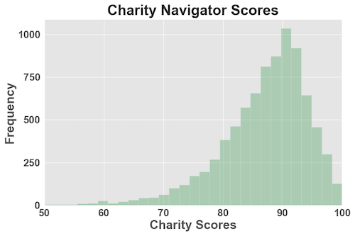

# Charity Recommender

Access the web application at [http://www.charityrecommender.com/](http://www.charityrecommender.com/)

A 1-page project summary is available [here](IMG/Charity_Recommender_1pager.pdf)

## Project Motivation
- Charitable organizations improve our society
- These organizations allocate resources to promote academic success, combat global catastrophes, and support countless other noble causes
- The motivation for this project stems from a passion to support charitable organizations and connect donors to new charities

## Goals:
- Recommend local charities from a user-inputted category and zipcode
- Build a recommendation system to recommend charities that are similar to user-selected charity

# Table of Contents
- [Overview of the Data](#Overview-of-the-Data)
- [Exploratory Data Analysis](#Exploratory-Data-Analysis)
- [Data Pipeline](#Data-Pipeline)
- [Model Selection](#Model-Selection)
- [Wordclouds](#WordClouds)
- [Conclusion and Next Steps](#Conclusion-and-Next-Steps)

# Overview of the Data

## First Dataset - IRS:
#### The first dataset comes from [IRS.gov](https://www.irs.gov/charities-non-profits/exempt-organizations-business-master-file-extract-eo-bmf) and contains information about charitable organizations in the United States

- Original Data Set
  * 1,719,673 charities (rows)
  * 28 features for each charity (columns)
- Data Cleaning:
  * Keep charities that offer fully tax deductible donations and have an NTEE Category Code
  * Translate NTEE code into category column
  * Keep essential column features
- Cleaned Data Set
 * 992,318 charities (rows)
 * 10 features for each charity (columns)

#### Preview of IRS Data Set:

| EIN | NAME | STATE |INCOME_CD | ZIP_FIVE	 | NTEE_Major_Category	 |  County |
|:---:|:---:|:---:|:---:|:---:|:---:|:---:|
|10130427	|BRIDGTON HOSPITAL	|ME	|9	|04009	|Health - General and Rehabilitative	|Cumberland County|
|10024645	|BANGOR SYMPHONY ORCHESTRA	|ME	|6	|04402	|Arts, Culture and Humanities	|Penobscot County|
|10015091	|HANOVER SOCCER CLUB INC	|NJ	|4	|07927	|Recreation, Sports, Leisure, Athletics	|Morris County|

## IRS Dataset - Exploratory Data Analysis

|||
|---|---|
|||

|||
|---|---|
|||

## Second Dataset - Kaggle:
#### The second dataset comes from [Kaggle](https://www.kaggle.com/katyjqian/charity-navigator-scores-expenses-dataset) and contains information about charities rated by [CharityNavigator.org](https://www.charitynavigator.org/) : 

- Original Data Set
  * 8,400 charities (rows)
  * 20 features for each charity (columns)
- Data Cleaning:
  * Keep all charities
  * Keep essential column features
  * Create "corpus" column that contains information about charity category, description, motto, and state
- Cleaned Data Set
 * 8,400 charities (rows)
 * 8 features for each charity (columns)

#### Preview of Kaggle Data Set:

| name	|ein	|category	|description	|motto	|score	|state
|:---:|:---:|:---:|:---:|:---:|:---:|:---:|
|1000 Friends of Oregon	|930642086	|Environment	|Working with Oregonians to enhance our quality...|	Great communities. Working lands. Iconic Places.	|91.94	|OR|
|WYPR	|311770828	|Arts, Culture, Humanities	|Serving the metropolitan Baltimore area and th...|	88.1 FM -. Your NPR News Station	|85.59	|MD|
|Two Ten Footwear Foundation	|222579809	|Human Services	|Funded solely by the footwear industry, Two Te...|	Shoepeople Helping Shoepeople	|90.26|	MA|

<a href="#Charity-Recommender-System">Back to top</a>

## Kaggle Dataset - Exploratory Data Analysis

|||
|---|---|
|The distribution of charity description lengths is left-skewed with a median of 690 characters. These descriptions will serve as the documents to create the TF-IDF vectorizer which will be used to find similarity between charities.|The distribution of charity scores, as ranked by CharityNavigator, is left-skewed with a median of 88.31% These scores are indicators of a charity's financial health and Accountability & Transparency.|

|||
|---|---|
|The most common charity category in our database is Human Services, which constitutes 28.32% of charities. The second most common is Arts, Culture, and Humanities at 14.5% followed by Health and Community Development at about 10% each.|Investigating the charities counts by state reveals that New York and California are the most common charity headquarter locations, constituting about 12% of our database each. The next three most-common are Texas, Washington D.C., and Florida at about 5% each.|

<!-- # For further EDA please look at the summary [here](ExploratoryDataAnalysis.md) -->

<a href="#Charity-Recommender-System">Back to top</a>

# Data Set 1 Pipeline - Local Charity Recommender

<!-- #region -->
#### To further process our data, the pipeline will:
- Take a category and zipcode as user input
- Filter charities on selected category
- Assign a "locality score" to each charity
  * Income code used as baseline score
  * Multiply incode by "locality" - based on if charity is in the same zipcode, county, or state
- Returns the top 3 scored charities as the recommendation to user

#### The code to do this can be found [here](src/Charity_Recommender_Functions.py)

# Data Set 2 Pipeline - Similar Charity Recommender

<!-- #region -->
#### To further process our data, the pipeline will:
- Take a charity name as user input
- Use an LDA model to create a "similarity score" for that charity compared to all other charities in database
  * Compares keyword usage and similarity among charity categories, descriptions, mottos, and states
- Returns the top 3 similarity scored charities as the recommendation to user

#### The code to do this can be found [here](src/charity_navigator_functions.py)

<a href="#Charity-Recommender-System">Back to top</a>
<!-- #endregion -->

# Model Selection

The Charity Navigator Dataset contains 11 categories. Recommending one of these categories at random would result in the same category  getting recommended 9.09% of the time. The goal for the recommendation model is to improve this score to above 50%.
The code for this can be found [here](src/Charity_Navigator_LDA_Similarity.ipynb)

We will use Latent Dirichlet Allocation:
-                   - Accuracy = 30.00%
-                   - Accuracy = 40.00%
-                   - Accuracy = 50.00%
-                   - Accuracy = 60.00%
-                   - Accuracy = 70.00%

<a href="#Charity-Recommender-System">Back to top</a>

# Conclusion and Next Steps

# Deployment

Web Application Deployed on an Amazon EC2 Instance

## Built With

* [Python](https://www.python.org/) - Coding Language for Machine Learning Application
* [Gensim](https://radimrehurek.com/gensim/index.html) - Used for Latent Dirichlet Allocation - Topic Modeling
* [Flask](http://flask.palletsprojects.com/en/1.1.x/) - Framework for Creating the Web Application

## Author

* **Jack Vessa** 

## Acknowledgments

* Thank you to those that support charitable organizations and help to make our world a better place

<a href="#Charity-Recommender-System">Back to top</a>
